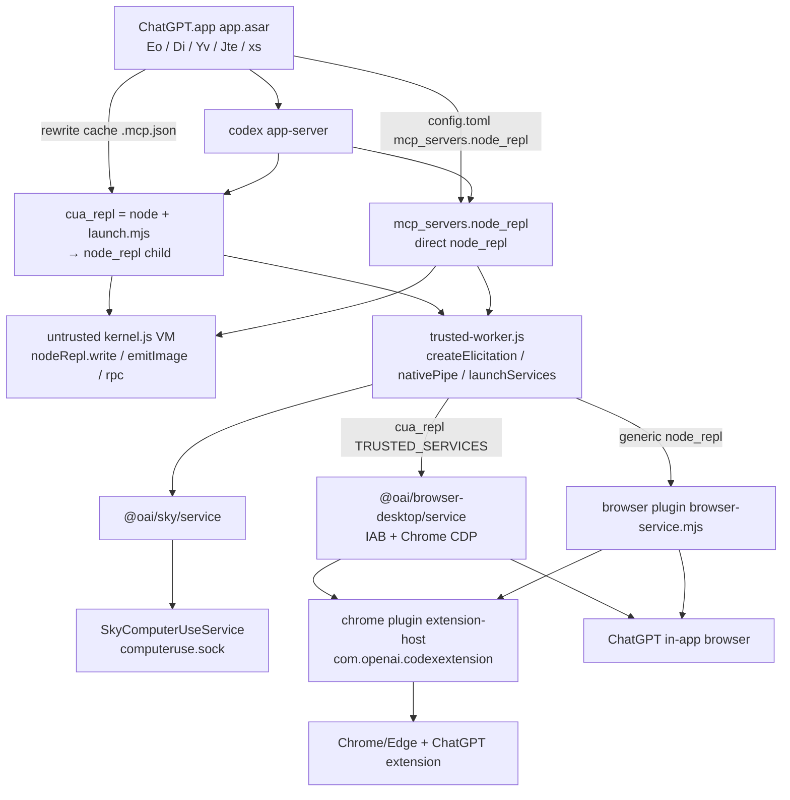

# FINDINGS — remaining REPL / plugin / Chrome / IAB wiring

Local ChatGPT.app only (`26.903.61454`). No exploits. No tokens.

This note closes the leftover wiring that agents 03/04/06 left as questions: the actual `nodeRepl` host APIs (untrusted vs trusted), all four `node_repl` MCP tools plus `timeout_ms`, Chrome vs IAB plugin split (and Sites), Computer History / Record & Replay vs CUA, the Electron rewrite of `unified-computer-use` `.mcp.json` **confirmed from `app.asar`**, and `request_user_input_async` from traces + the Codex binary.

---

## Verdict

Computer+browser use on this desktop is **two MCP `js` servers plus a family of plugins that do not implement `js`**.

| Server | Who starts it | What the model is supposed to call |
|---|---|---|
| `cua_repl` | hidden plugin `unified-computer-use` after Electron `Di()` rewrite | tinysky `cua.*` (banner `setupCUA`) |
| `node_repl` | Electron `Yv()` → `config.toml` `[mcp_servers.node_repl]` | skill bootstrap `setupBrowserRuntime` / `import("@oai/sky")` |
| `computer-use` / `computer-history` / `event-stream` / `messages` | `SkyComputerUseClient` via `computer-use-client-launcher` | native MCP tools, **not** `js` |

On this machine both `node_repl` and `cua_repl` are live. Traces used unprefixed `js` with `cua.getBrowser` / `cua.getApp` → **cua_repl**. Browser/Chrome **skills** are the generic-`node_repl` path; when tinysky is on, Electron **deletes those skill directories** (`Jte()`), so the model is steered onto `cua.*`.

`request_user_input_async` is **not** a CUA/REPL tool. It is Codex `functions.request_user_input_async` (`core/src/tools/handlers/request_user_input_async.rs`). Traces used it once in the Linear task; the tool returned `{"accepted":true}` without waiting.



---

## 1. `nodeRepl` host APIs

There are **two** `nodeRepl` objects. User `js` sees the untrusted VM bridge. `@oai/sky/service` and `@oai/browser-desktop/service` run in `trusted-worker.js` and see the privileged prototype.

Source: embedded JS in `/Applications/ChatGPT.app/Contents/Resources/cua_node/bin/node_repl` (`kernel.js`, `worker-runtime.js` / `createNodeReplBridge`, `privileged-node-repl.js`, `trusted-worker.js`).

### 1.1 Untrusted VM (what `js` code can call)

Created by `createNodeReplBridge`, then `Object.freeze` + `defineLockedGlobal(runtimeContext, "nodeRepl", nodeRepl)`. Also locked: `tmpDir`.

| Member | Sync? | Behavior |
|---|---|---|
| `cwd` | — | kernel `--working-dir` after `chdir` |
| `env` | — | snapshot of `NODE_REPL_UNTRUSTED_ENV_ALLOWLIST` (comma list). Trusted worker sees full `process.env`. |
| `homeDir` | — | `process.env.HOME` or `null` |
| `tmpDir` | — | `os.tmpdir()` (sandbox may redirect `TMPDIR`). Also a **locked global** of the same value. |
| `requestMeta` | getter | frozen MCP request meta for this exec (`openai/confirmation_policies`, `x-codex-turn-metadata`, …). Fallback env: `NODE_REPL_REQUEST_META`. |
| `write(value, itemId?)` | **sync** | `formatLog([value])` → `outputEvents` `{kind:"write", text, item_id?}`. `itemId` must be a nonempty string if present. Tinysky uses `"cua.core"`, `"cua.browser"`, `"cua.state"`. |
| `emitImage(imageLike)` | **async** | normalize → JSONL `{type:"emit_image", image_url}` and wait for host ack. Tracked as a background task so the cell does not finish until attached. |
| `emitAudio(audioDataUrl)` | **async**, only if `NODE_REPL_ENABLE_AUDIO=1` | data-URL only (`audio/*`). Else the method is **absent**. |
| `rpc(service, request)` | **async**, only if `NODE_REPL_TRUSTED_RPC_ENABLED=1` | JSON-serializable request → trusted worker `{type:"trusted_service_request", service, request}`. Tinysky/browser-client/sky client all go through this. |

`NODE_REPL_TRUSTED_RPC_ENABLED=1` is set by the Rust host when it actually spawned the trusted worker, **not** by `launch.mjs`. It was unset on the live cua_repl child env dump (agent 04) because that dump was the MCP wrapper process; the kernel child gets it.

`write` is not `console.log`. Console is captured as `{kind:"line"}`. Named `itemId` streams become `named_outputs` (Map insertion order, values only).

#### `emitImage` accepted shapes

- `data:` URL (passed through)
- `file:` URL → `readFileSync` + sniff PNG/JPEG/WebP
- `Uint8Array` / `Buffer` / `ArrayBuffer` / view → sniff mime
- `{ bytes, mimeType }` and **no other keys**

Errors in the binary: `nodeRepl.emitImage only accepts data or file URLs`, `could not infer image MIME type … expected PNG, JPEG, or WebP`, `expected non-empty bytes`, `missing emitted image`.

### 1.2 Privileged worker (trusted services only)

`createPrivilegedNodeReplBridge` does `Object.create(nodeRepl, privilegedNodeReplProperties)` so the worker inherits `write` / `emitImage` / cwd/env and **adds**:

| Member | Role |
|---|---|
| `createElicitation({ message, meta?, requestedSchema? })` | MCP form elicitation. Requires `form_elicitation_supported` on the exec message. Sends `{type:"elicit", message, requested_schema, meta}`. Resolves `{action, content, _meta}`. Extra keys throw. Empty `requestedSchema` defaults to `{type:"object", properties:{}}`. **Not** `request_user_input_async`. |
| `fetch(input, init)` | Host `authenticated_fetch` (not the VM’s Node `fetch`). Body as `body_base64`. |
| `nativePipe.createConnection(path)` | Host-mediated unix-socket / named-pipe. Returns `{write, on("data"|"close"|"error"), end}`. Frames are `native_pipe_request` / `_response` / `_data` / `_closed`. |
| `launchServices.openApplication({ applicationPath } \| { bundleIdentifier })` | Exactly one of the two keys. Host `launch_services_action` / `open_application`. Used by `@oai/sky` if the CUA socket is down. |
| `config.readToml / writeToml / read / readRequirements / writeValue / batchWrite` | Codex config. `writeToml("config.toml")` is refused (`use writeValue or batchWrite`). |
| `addTurnEndedHandler(fn)` | MCP `turn_ended` runs these (`hook_event_name`, `session_id`, `turn_id`). Dedupe is on the Rust side per (session, turn). |
| `addAfterSubmittedCodeHook(fn)` | After each `js` cell (`run_hooks` / `submitted_code_complete`). |
| `setResponseMeta(obj)` | Merge + JSONL `response_meta`. |
| `emitContentItem(text)` | Extra MCP content items (string only). |
| `withSuspendedTimeout(fn)` | `suspend_timeout` / `resume_timeout` around trusted work that would otherwise trip the 30s `js` timer. **Not on the untrusted bridge.** |
| `gaasBrowserConfig` | getter from current exec (cloud/CDP). |
| `otel.log(name, attrs)` | best-effort audit. |
| `telemetry` | only if `NODE_REPL_TRACE_META=1`. |

Sky Mac transport (`vendor/sky/js/native-pipe.js`) uses **privileged** APIs:

1. `nodeRepl.nativePipe.createConnection` to `SKY_CUA_SERVICE_NATIVE_PIPE_PATH` or `~/Library/Group Containers/2DC432GLL2.com.openai.sky.CUAService/IPC/computeruse.sock`.
2. On failure: JSON-RPC `ensureService { service: "computer-use" }` over `NODE_REPL_HOST_SERVICES_PIPE_PATH`, else `launchServices.openApplication` with `SKY_CUA_SERVICE_PATH` / `CODEX_HOME/computer-use/Codex Computer Use.app` / bundle id `com.openai.sky.CUAService`.

Untrusted `js` **cannot** call `nativePipe` / `launchServices` / `createElicitation`. Those exist only on the worker `globalThis.nodeRepl`.

### 1.3 Kernel `rpc("browser"|"sky", …)`

Trusted service map is `NODE_REPL_TRUSTED_SERVICES` JSON.

- **cua_repl child** (`launch.mjs` overwrite): `{ browser: "@oai/browser-desktop/service", sky: "@oai/sky/service" }` according to surfaces.
- **generic `node_repl`**: `{ browser: "<plugin cache>/browser/<ver>/scripts/browser-service.mjs", sky: "@oai/sky/service" }`.

Each module must export `handleRpc`. Bare specifiers resolve only inside `NODE_REPL_NODE_MODULE_DIRS`. File URLs must `realpath` under `NODE_REPL_TRUSTED_CODE_PATHS` (`CODEX_HOME` + cua_node modules).

---

## 2. MCP tools: `js`, `js_reset`, `turn_ended`, `js_add_node_module_dir`, `timeout_ms`

Implemented by Rust `node_repl` (`src/mcp_server.rs`). Plugins only wrap / allowlist / override descriptions.

### 2.1 `js`

Stock description (binary):

> Execute JavaScript in a persistent `node_repl` with top-level await. … Use `nodeRepl.write(value)` … `await nodeRepl.emitImage(image)` … `nodeRepl.cwd`, `nodeRepl.homeDir`, `nodeRepl.tmpDir`, and `nodeRepl.requestMeta`. The default timeout is 30000 ms … increase `timeout_ms` … Use `js_add_node_module_dir` when an additional package directory is required.

Schema fields (binary + traces):

| Field | Required | Notes |
|---|---|---|
| `code` | yes | “JavaScript code to execute with top-level await.” cua_repl override: “JavaScript to execute using the initialized CUA runtime.” |
| `title` | no | “Short user-facing description of what the code does.” |
| `timeout_ms` | no | “Optional execution timeout in milliseconds. Defaults to 30000 (30 seconds) when omitted.” Integer. |

Traces advertised:

```json
{"type":"object","properties":{"code":{"type":"string"},"timeout_ms":{"type":"integer"},"title":{"type":"string"}},"required":["code"],"additionalProperties":false}
```

**No captured call set `timeout_ms`.** Override JSON from `launch.mjs` replaces `description` + `field_descriptions.code` only; `title` / `timeout_ms` stay on the stock schema.

cua_repl `.mcp.json` also sets `tools.js.output_token_limit: 25000` (Codex-side cap, not a kernel limit).

First `js` of a kernel prepends `NODE_REPL_JS_BANNER` then deletes it from `process.env`. Banner for unified-computer-use is `setupCUA({browser, computer})`.

### 2.2 `js_reset`

Stock: “Reset the JavaScript kernel and clear all bindings.”  
cua_repl override (`js-reset.md`): next **cua_repl.js** call re-inits enabled surfaces; does **not** close tabs/apps.

Args: `{}`. Trace result: `js kernel reset`. Kernel process is killed; next `js` starts a new Node + re-runs the banner. `js_add_node_module_dir` roots **survive**. Trusted worker stays up (handlers Map kept).

### 2.3 `turn_ended`

Not overridden by `launch.mjs`. Description:

> Notify trusted libraries that a Codex turn ended. Repeated notifications for the same session and turn are ignored.

Args: `hook_event_name`, `session_id`, `turn_id` (all nonempty; `minLength` on the event name). Error: `turn_ended requires non-empty event, session, and turn IDs`. Timeouts: `turn-ended handlers timed out` / `turn-ended response channel closed`.

Fan-out on this machine:

| Channel | Caller | Receiver |
|---|---|---|
| MCP `cua_repl.turn_ended` | unified-computer-use hooks Interrupt / Stop / SubagentStop | cua_repl trusted `browser` + `sky` |
| MCP `node_repl.turn_ended` | **browser + chrome** plugin hooks (same three events) | generic `node_repl` |
| Codex `notify` argv | `config.toml` `notify = [SkyComputerUseClient, "turn-ended"]` | native client, not MCP |

SubagentStop interpolates `session_id: "${agent_id}"`.

### 2.4 `js_add_node_module_dir`

Stock tool, **not** in cua_repl `enabled_tools`. Description:

> Add an absolute `node_modules` directory for package imports. The directory remains available after `js_reset`.

Arg: absolute path (“Absolute path to a node_modules directory…”). Kernel message `{type:"add_node_module_dir", path}` → `addModuleSearchBase`. Generic `node_repl` still advertises it; browser/chrome skills tell the model **not** to call it while hunting for `js`.

### 2.5 Allowlist vs omit

Shipped and rewritten cua_repl `.mcp.json`:

```json
"enabled_tools": ["js", "js_reset", "turn_ended"],
"omit_tools_from": ["code_mode", "deferred"]
```

Code-mode computer-use is attributed to generic `node_repl` (`tne()` in `app.asar`: `pluginId: computer-use@openai-bundled`, `mcpServerName: node_repl`, `invocationSource: code_mode`).

Unprefixed names: `src-J2PvP4xj.js` `Jv(e){return e==="node_repl"||e==="cua_repl"}`. Traces show `"name":"js"` and also `mcp__cua_repl` in `additional_tools`.

---

## 3. ChatGPT.app rewrite of unified-computer-use `.mcp.json` (confirmed from `app.asar`)

**Confirmed in** `/Applications/ChatGPT.app/Contents/Resources/app.asar` → `.vite/build/main-D87AK7lw.js` (function `Di`) and `.vite/build/src-J2PvP4xj.js` (plugin table + `Yv`). No secrets in these slices.

### 3.1 Shipped vs live

App bundle (disabled stub):

`/Applications/ChatGPT.app/Contents/Resources/plugins/openai-bundled/plugins/unified-computer-use/.mcp.json`

```json
{
  "mcpServers": {
    "cua_repl": {
      "command": "node",
      "args": ["scripts/launch.mjs"],
      "enabled": false,
      "enabled_tools": ["js", "js_reset", "turn_ended"],
      "omit_tools_from": ["code_mode", "deferred"],
      "startup_timeout_sec": 120,
      "tools": { "js": { "output_token_limit": 25000 } }
    }
  }
}
```

Live cache (what Codex actually execs):

`/Users/dongdong/.codex/plugins/cache/openai-bundled/unified-computer-use/26.903.61454/.mcp.json`

- `enabled: true`
- `command` = bundled Node `…/cua_node/bin/node` (**not** `node_repl`)
- `args` = absolute `scripts/launch.mjs` in the cache dir
- `env.CUA_REPL_NODE_REPL_PATH` = `…/cua_node/bin/node_repl`
- `env.CUA_REPL_ENABLED_SURFACES` = `browser,computer`
- `env.BROWSER_USE_AVAILABLE_BACKENDS` = `chrome,iab`
- plus the copied generic `node_repl` env (`NODE_REPL_*`, `CODEX_HOME`, `SKY_CUA_SERVICE_PATH`, use-case strings, `NODE_REPL_TRUSTED_SERVICES` pointing at the **browser plugin** service — then `launch.mjs` overwrites trusted services for the child)

Atomic write: `${path}.tmp-${uuid}` then `rename`.

### 3.2 `Di()` (main-D87AK7lw.js) — the writer

Reconstructed from the minified function (names match agent 04):

```js
async function Di(e) {
  const plugin = findPlugin(e.marketplaces, n.uc /* "unified-computer-use" */);
  if (!plugin?.installed) return false;
  const enable = e.nodeRepl != null && e.surfaces.length > 0;
  const mcpPath = join(pluginCacheDir, ".mcp.json");
  const parsed = Ti.parse(JSON.parse(await readFile(mcpPath))); // { mcpServers: { cua_repl: {} } }
  const c = parsed.mcpServers.cua_repl;
  c.enabled = enable;
  c.env_vars = e.nodeRepl?.env_vars ?? [];
  c.env = {
    ...e.nodeRepl?.env,
    CUA_REPL_NODE_REPL_PATH: e.nodeRepl?.command,          // node_repl binary
    CUA_REPL_ENABLED_SURFACES: e.surfaces.join(","),       // "browser,computer"
    BROWSER_USE_AVAILABLE_BACKENDS: e.browserBackends.join(","),
  };
  if (e.nodeRepl != null) {
    c.command = e.nodeRepl.env.NODE_REPL_NODE_PATH;        // cua_node/bin/node
    c.args = [join(pluginCacheDir, "scripts/launch.mjs")];
  }
  atomicWrite(mcpPath, parsed);
  return enable;
}
```

Call site (same file): after `Eo()` selection, if `hostConfig.kind === "local"`:

```js
w = await Di({
  browserBackends: x,   // from Eo
  surfaces: S,          // cuaReplSurfaces
  codexHome: v,
  marketplaceName: y,
  marketplaces: g,
  nodeRepl: h ? undefined : e,  // WSL → do not pass nodeRepl (stays disabled)
});
await Jte({ cuaReplSurfaces: w ? S : [], ... });
e != null && w && Ei(e, S);     // clear use-case strings on generic node_repl
```

Then `config/batchWrite` either keeps `mcp_servers.node_repl` or writes the disabled stub `wi` if cua_repl did not enable.

### 3.3 `Zte()` / `Eo()` — when rewrite is allowed and which surfaces

`Zte({features, runtimePaths, marketplaces, shouldUseWslPaths, …})`:

```
browserUseTinysky
&& !WSL
&& nodePath != null && nodeReplPath != null
&& mcpToolExposure (app-server capability)
&& unified-computer-use installed + enabled + AVAILABLE
```

`Eo()` builds backends + surfaces:

```
d = []
externalBrowserUse && d.push("chrome")
inAppBrowserUse    && d.push("iab")

f = Zte(...)
p = f && darwin && computerUse && computer-use plugin enabled
    && SkyComputerUseService app path exists
h = []
f && d.length > 0 && h.push("browser")
p && h.push("computer")

return { browserBackends: d, cuaReplSurfaces: h, ... }
```

So:

- Browser surface on cua_repl requires tinysky + at least one of IAB / external Chrome.
- Computer surface on cua_repl requires tinysky + Computer Use plugin + native app path (Mac only).
- Live this machine: `browser,computer` and backends `chrome,iab`.

Desktop feature defaults in the same asar module (`tr` / `nr`) start **all CUA flags false** (`inAppBrowserUse`, `externalBrowserUse`, `browserUseTinysky`, `computerUse`, `computerUseNodeRepl`, `skysight`, `recordAndReplay`, `sites`, …) until cloud/device config flips them. `openAIMcpFormElicitations` defaults **true** (enables `createElicitation`).

### 3.4 `Yv()` — generic `mcp_servers.node_repl`

In `src-J2PvP4xj.js`:

```js
Hv = "node_repl"
Uv = "cua_repl"
function Jv(e){ return e === "node_repl" || e === "cua_repl" }

function Yv({codexCliPath, codexHome, envVars, extraEnv, nodeModuleDirs, nodePath, nodeReplPath, ...}) {
  if (nodePath == null || nodeReplPath == null) return null;
  const env = {
    NODE_REPL_NATIVE_PIPE_CONNECT_TIMEOUT_MS: "1000",
    NODE_REPL_NODE_MODULE_DIRS: nodeModuleDirs,
    NODE_REPL_NODE_PATH: nodePath,
    NODE_REPL_TRUSTED_CODE_PATHS: join(codexHome, nodeModuleDirs),
    CODEX_HOME: codexHome,
    ...extraEnv,           // from xs(): backends, tinysky, trusted services, use-case strings, SKY_*
    ...(codexCliPath ? { CODEX_CLI_PATH: codexCliPath } : {}),
  };
  return { [`mcp_servers.${Hv}`]: { args: [], command: nodeReplPath, env, startup_timeout_sec: 120 } };
}
```

`xs()` extraEnv (main.js) is what fills `NODE_REPL_TRUSTED_SERVICES` with the **browser plugin** `browser-service.mjs` path plus `sky: "@oai/sky/service"`, `BROWSER_USE_TINYSKY_ENABLED`, `NODE_REPL_INSTRUCTIONS_USE_CASE_{BROWSER,CHROME,COMPUTER_USE}`, `BROWSER_USE_AVAILABLE_BACKENDS`, etc.

`Ei(env, surfaces)` **clears** those three use-case strings on the generic `node_repl` when cua_repl took the surface (`""` = surface enabled, matching live `config.toml`). cua_repl **keeps** the filled sentences because `Di` copies `e.nodeRepl.env` before `Ei`.

### 3.5 `Jte()` — hide Browser/Chrome/Computer Use skills when tinysky owns the surface

```js
var qte = {
  [n.tc]: "control-in-app-browser",  // browser
  [n.ic]: "control-chrome",          // chrome
  [n.rc]: "control-chrome",          // chrome-internal
  [n.nc]: "control-chrome",          // chrome-dev
  [n.sc]: "computer-use",
};
// exposeSkills = !cuaReplSurfaces.includes(plugin==computer-use ? "computer" : "browser")
// if !exposeSkills → rm the installed skills/<name> directory
```

When cua_repl has `browser`, Electron **removes** `control-in-app-browser` and `control-chrome` from the plugin cache. When it has `computer`, it removes the computer-use skill. Inverse: if tinysky is off, those skills come back and the model is told to `import("<plugin>/scripts/browser-client.mjs")` / `import("@oai/sky")` through generic `js`.

Hooks on browser/chrome plugins **still** fire `node_repl.turn_ended` even with skills removed.

### 3.6 Plugin catalog (`vy` in src-J2PvP4xj.js)

```js
vy = {
  unifiedComputerUse: { hidden: true, installWhenMissing: true, mcpServerName: "cua_repl", name: "unified-computer-use" },
  browser:            { installWhenMissing: true, name: "browser" },
  chrome:             { name: "chrome" },                 // NOT auto-install
  chromeInternal/Dev: { name: "chrome-internal" / "chrome-dev" },
  computerUse:        { installWhenMissing: true, installWhenMissingRequiresOptIn: true, name: "computer-use" },
  sites:              { installWhenMissing: true, name: "sites" },
  recordAndReplay:    { name: "record-and-replay" },
  computerHistory:    { name: "computer-history" },
  messages:           { name: "messages" },
  ...
}
```

`unified-computer-use` is hidden + always installed when missing. `computer-use` is the visible picker tile and requires opt-in. `chrome` is user-installed (synced to whether the ChatGPT extension is present). `sites` auto-installs but is **not** a CUA surface.

---

## 4. Chrome plugin + IAB (`browser`, `chrome`, `sites`)

### 4.1 Three plugins, two control stacks, one Sites builder

| Plugin | MCP? | Skill | Hooks `turn_ended` | Extra bits |
|---|---|---|---|---|
| `browser@openai-bundled` | **no** | `control-in-app-browser` | `node_repl` | IAB-first copy; `scripts/browser-client.mjs` + `browser-service.mjs`; **no** extension-host |
| `chrome@openai-bundled` | **no** | `control-chrome` | `node_repl` | same client/service + **`extension-host/`** + `installManifest.mjs` |
| `sites@openai-bundled` | **no** | `sites-building` / `sites-hosting` | none | website builder; `.app.json` connector id only |

Browser and Chrome skills are **byte-identical** except YAML frontmatter / display strings. Both say: import **this plugin’s** `scripts/browser-client.mjs` (never the built-in `@oai/browser-desktop` client), run it through `mcp__node_repl__js`, then `agent.browsers.get("iab"|"chrome"|"edge")` / `getForUrl` / `getDefault`.

That is the **legacy** path. With tinysky on, `Jte()` removes those skills and `cua_repl` banner installs global `cua` instead. Traces match tinysky (`cua.getBrowser({url})`, tab id `"1"`, not `agent.browsers.get("iab")`).

cua_repl still talks to browsers through `@oai/browser-desktop/service` (IAB + extension). The Chrome plugin is still required on disk for: native-messaging host install, extension-id catalog, diagnostics, and Electron’s “is the extension installed?” sync.

### 4.2 IAB vs Chrome vs CDP

From `@oai/browser-desktop` `docs/api.json` / service matcher (agent 03) plus plugin copy:

| Selector | Type | How it is chosen |
|---|---|---|
| `"iab"` | in-app browser | `@Browser` / `plugin://browser@openai-bundled`. `getDefault` prefers iab. `getForUrl` prefers iab for `file:` and localhost/`127.0.0.1`/`::1`. |
| `"chrome"` / `"edge"` / brave/opera/vivaldi | `type:"extension"`, family key | ChatGPT extension + native host. Tab claiming (`browser.user.claimTab`) exists **only** here. |
| opaque instance id | exact `id` | after `list()` |
| `"cdp"` | cloud/gaas | third backend; not in live `BROWSER_USE_AVAILABLE_BACKENDS=chrome,iab` |

Live trace: `getBrowser({url: ant.design/form})` then `listTabs` → `browserId:"1"`, tab `"1"`. Alias `"iab"` is a **selector**, not the runtime id.

Ambient IAB context in the prompt is **not** an instruction to switch browsers (skill text). Task 1 used it as a hint and selected the already-open tab via `getTab("1")` instead of `createBrowserTab`.

### 4.3 Chrome-only install surface

Diff vs browser plugin:

- `extension-host/macos/arm64/ChatGPT for Chrome` — native messaging helper
- `scripts/installManifest.mjs` — writes `com.openai.codexextension.json` into each Chromium `NativeMessagingHosts` dir and `extension-host-config.json` next to the host binary

Host config (`installManifest.mjs` `X()` / `O()`):

```js
{
  schemaVersion: 1,
  channel: "prod",
  browserClientPath: "<plugin>/scripts/browser-client.mjs",
  codexCliPath, nodePath, nodeReplPath,  // from appServerRuntimePaths
  proxyHost: "127.0.0.1",
  proxyPort: 0
}
```

Native messaging manifest:

- name `com.openai.codexextension`
- type `stdio`
- `allowed_origins`: `chrome-extension://hehggadaopoacecdllhhajmbjkdcmajg/` (Chrome Web Store ChatGPT) and `chrome-extension://odlomjlbamekndcpllcnffbgeohgkmjh/` (Edge add-on)
- macOS paths under `~/Library/Application Support/{Google/Chrome,Microsoft Edge,BraveSoftware/Brave-Browser,com.operasoftware.Opera,Vivaldi}/NativeMessagingHosts/`

`scripts/extension-ids.json` is shared (browser and chrome copies are identical). Families: chrome, edge, brave, opera, vivaldi.

`scripts/check-extension-installed.js` exit codes: `0` installed+enabled, `1` installed not enabled, `2` not installed, `3` runtime error. Electron `Ra()` / `za()` uses this (or `ha`) to sync chrome plugin install state (`syncInstallStateWithChromeExtensionPluginNames`).

Other chrome/browser scripts (both trees): `chrome-is-running.js`, `open-chrome-window.js`, `check-native-host-manifest.js`, `installed-browsers.js`, `chromium-browser-diagnostics.mjs`.

### 4.4 Sites

`/Applications/ChatGPT.app/Contents/Resources/plugins/openai-bundled/plugins/sites/`

- **Not** a browser-control plugin. No MCP, no `turn_ended`, no `browser-client`.
- Skills: build/deploy websites (`sites-building`, `sites-hosting`).
- `.app.json`: `{ "apps": { "sites": { "id": "connector_20205bf7d4e99a89d7154bb849718324" } } }`.
- Auto-install (`installWhenMissing: true`). Feature flag `sites` in the same desktop-feature table as CUA.
- Relation to CUA: browser skill text says after significant frontend changes, use the in-app browser to open localhost. Sites preview can therefore land in **IAB**, but Sites does not drive `cua.*` / `tab.*`.

---

## 5. Computer History + Record & Replay vs CUA

Both are **siblings of Computer Use**, not `js` tools. They reuse the same native client binary.

| Plugin | MCP server name | Launcher argv | Skill tools |
|---|---|---|---|
| `computer-use` | `computer-use` | `computer-use-client-launcher mcp` | UI automation via `sky.*` **or** (node-repl variant) `js` |
| `computer-history` | `computer-history` | `… computer-history mcp` | `computer_history_status/pause/resume/get_settings/update_settings` |
| `record-and-replay` | `event-stream` | `… event-stream mcp` | `event_stream_start/status/stop` |
| `messages` | `messages` | `… messages mcp` | Messages.app (same launcher family) |

Launcher (all four copies are the same 14-line `#!/bin/sh`):

```
exec "$CODEX_HOME/computer-use/Codex Computer Use.app/.../SkyComputerUseClient" "$@"
```

`SkyComputerUseClient` strings confirm the MCP tool names above, plus `Handles a Codex turn-ended notification` (the `notify = […, "turn-ended"]` path).

### vs CUA / tinysky

- **Computer Use** (when `bundledContentVariant: "node-repl"`) tells the model to use `node_repl` + `sky.*`. Unified-computer-use / tinysky is the replacement (`cua.getApp`). Live `mcp_servers.computer-use.enabled = false`; native AX still works because ChatGPT.app starts `SkyComputerUseService` itself and `@oai/sky/service` uses the group-container socket.
- **Computer History** is a rolling local event stream + `~/.codex/memories/extensions/skysight/` summaries. Skill: do **not** use Record & Replay tools for “what was I doing”. Observation settings are MCP-only (do not edit files). Private browsing always excluded. Feature flags: `skysight` (desktop) + plugin `computer-history`.
- **Record & Replay** is an explicit, user-confirmed, ≤30 min capture that becomes a skill. `event_stream_start` elicits confirmation. MCP does **not** return event contents; the model reads `events.jsonl` / `session.json` from disk after stop. Generated skills are told to prefer connectors, then Computer Use (`cua` / `js`) for UI. Observation settings of Computer History do **not** apply.

Shared native pipeline: same `SkyComputerUseService` AX/event tap. History is continuous (if enabled); R&R is session-scoped; CUA `js` is interactive control. `turn_ended` / lock-screen guardian / PiP belong to the Computer Use service, not History.

---

## 6. `request_user_input_async` (traces)

### 6.1 Wire facts (agent 05 + `calls.json`)

Task 2 Linear, capture `0223_WS_backend-api_codex_responses`:

| | |
|---|---|
| tool | `request_user_input_async` |
| namespace | `functions` (with `exec`, `wait`, `request_user_input`) — **not** `mcp__cua_repl` |
| call_id | `call_8ttSMORM5eSYvZywmZv8VPhP` |
| item_id | `fc_05a61cc4349bad21016aa280a05f0487d081bb1e09838a7da0` |
| ts | `2026-09-10T10:04:17.965Z` |
| args | `{"questions":[{"title":"这个 issue 要记录什么？请给我标题或一句话描述；如果是接着刚才的测试，我可以建「补充 Ant Design Form 组件交互测试」，并指派给你。"}]}` |
| tool result | `{"accepted":true}` |
| later user | answer `可以的` (pre-extracted traces labeled this row `js?` because `function_call_arguments.done` has no `name`/`call_id`) |

Task 1 had **no** `request_user_input*`. Sync `request_user_input` was advertised on every `response.create` and never called.

Advertised next to it: `mcp__cua_repl` (`js`, `js_reset`), `clock.sleep`, `collaboration.*`. `timeout_ms` present on `js` schema, unused.

### 6.2 Implementation (Codex binary, not Electron)

`/Applications/ChatGPT.app/Contents/Resources/codex` contains `core/src/tools/handlers/request_user_input_async.rs`.

Tool description (binary strings):

> Ask the user one or more questions during ongoing work. Use this tool only to request missing information, preferences, constraints, clarification, or approval. **The tool returns immediately without ending the turn or waiting for a reply**; any reply arrives asynchronously as a new user message. … The UI always allows a free-text answer, including when suggested options are provided. A preselected option is not submitted automatically.

Fields:

- `questions` — “One or more self-contained questions … in display order.” Must be nonempty. Each `title` nonempty.
- `questions[].title` — “The complete question shown to the user…”
- `questions[].options` — “Suggested answers, in display order. Put the recommended answer first; the first option is preselected. … Omit options for a free-text-only question.” Must contain at least one nonempty answer if present. Do not include an “Other” option.

Immediate result blob: `{"accepted":true}` — matches the Linear capture. Validation errors: `questions must not be empty`, `question titles must not be empty`, `options must contain at least one non-empty answer`.

System prompt (same binary): use `functions.request_user_input_async`; do **not** ask for files/screenshots (text only); prefer multiple-choice; continue work that does not depend on the answer; optional wait ~60s for a simple MC question.

Sync `request_user_input` is a **different** tool: Default-mode prompt says prefer assumptions; if it returns no answers, continue; never use it for permission prompts. Linear used the async variant so CUA `js` could keep going (`getScreenshot` / `Raise` immediately after `accepted:true`, before the user typed `可以的`).

### 6.3 Desktop UI mapping (`app.asar` webview)

`webview/assets/app-initial-1b87ae739476.js` `EXn()`:

- If `questions` missing/empty → one widget from `e.text`.
- Else each question becomes `{ id: JSON.stringify(["request_user_input_async", e.id, n]), title, options: t.options ?? [] }`.
- Replies are later `userMessage` items (traces: `<send_user_message_question_reply>`).

This is **not** `nodeRepl.createElicitation` (MCP form elicitation for JS approval / trusted-service prompts).

---

## 7. How a `js` call actually reaches IAB / Chrome / native apps

1. Model → Codex `tools/call` `js` `{code, title?}`.
2. cua_repl `node_repl` kernel: optional banner `setupCUA` → `globalThis.cua` (+ `globalThis.agent` if browser).
3. User code `cua.getBrowser` / `getTab` / `getApp` → tinysky → `nodeRepl.rpc("browser"|"sky", {method/type, …})`.
4. Trusted worker `handleRpc`:
   - **browser**: IAB via ChatGPT’s in-app browser host; Chrome/Edge via extension + `com.openai.codexextension` stdio host (chrome plugin). Playwright is an injected subset on `tab.playwright`, not a Playwright process.
   - **sky**: native pipe to `SkyComputerUseService` (AX click/type/screenshot).
5. Observations: tinysky `write(..., "cua.state")` / `emitImage({bytes, mimeType:"image/png"})` unless `{emit:false}`.
6. Turn end: plugin hooks → `turn_ended` on **both** cua_repl and node_repl; plus native `SkyComputerUseClient turn-ended`.

Generic `node_repl` (if a skill were visible) would `import(pluginRoot/scripts/browser-client.mjs)` and `rpc` to **that plugin’s** `browser-service.mjs` instead of `@oai/browser-desktop/service`. Same IAB/Chrome backends, different package copy.

---

## 8. Absolute paths (this machine)

| What | Path |
|---|---|
| Electron injector | `/Applications/ChatGPT.app/Contents/Resources/app.asar` (`.vite/build/main-D87AK7lw.js` `Di`/`Eo`/`Zte`/`Jte`/`xs`; `.vite/build/src-J2PvP4xj.js` `Yv`/`Jv`/`vy`) |
| Codex binary (`request_user_input_async.rs`) | `/Applications/ChatGPT.app/Contents/Resources/codex` |
| `node` / `node_repl` | `/Applications/ChatGPT.app/Contents/Resources/cua_node/bin/{node,node_repl}` |
| CUA packages | `…/cua_node/lib/node_modules/@oai/{cua,sky,browser-desktop}` |
| App-bundle plugins | `/Applications/ChatGPT.app/Contents/Resources/plugins/openai-bundled/plugins/{browser,chrome,sites,unified-computer-use,computer-use,computer-history,record-and-replay,messages}/` |
| Live cua_repl `.mcp.json` | `/Users/dongdong/.codex/plugins/cache/openai-bundled/unified-computer-use/26.903.61454/.mcp.json` |
| Browser plugin service (generic node_repl) | `…/plugins/cache/openai-bundled/browser/26.903.61454/scripts/browser-service.mjs` |
| Chrome extension host | `…/plugins/openai-bundled/plugins/chrome/extension-host/macos/arm64/ChatGPT for Chrome` |
| Native CUA app | `/Users/dongdong/.codex/computer-use/Codex Computer Use.app` |
| Native socket | `~/Library/Group Containers/2DC432GLL2.com.openai.sky.CUAService/IPC/computeruse.sock` |

---

## 9. Coverage vs leftover questions

Closed here:

- Untrusted vs trusted `nodeRepl` members (`write`, `emitImage`, `emitAudio`, `createElicitation`, `cwd`/`homeDir`/`tmpDir`/`requestMeta`, `rpc`, `nativePipe`, `launchServices`).
- All four MCP tools + `timeout_ms` default 30000 + cua_repl allowlist.
- `Di()` rewrite **read back from app.asar** (not only reconstructed from the live file).
- Surfaces/backends computed by `Eo()` from `inAppBrowserUse` / `externalBrowserUse` / `computerUse` + tinysky gate `Zte()`.
- `Jte()` skill hiding when tinysky owns a surface.
- Chrome plugin = extension host + identical skill; IAB plugin = no host; Sites ≠ CUA.
- History / R&R = same `SkyComputerUseClient` argv, different MCP servers, not `js`.
- `request_user_input_async` = Codex functions tool; traces + binary description + immediate `{"accepted":true}`.

Still not fully decompiled (does not change the map):

- Exact Playwright/CDP method list inside 1.2MB `browser-service.mjs` (see agent 03).
- `SkyComputerUseClient mcp` tool list for the **disabled** `computer-use` server (would require spawning it).
- Whether both `turn_ended` hooks (cua_repl + node_repl) double-close IAB tabs in practice.
- Sync `request_user_input` desktop blocking behavior (unused in these traces).
