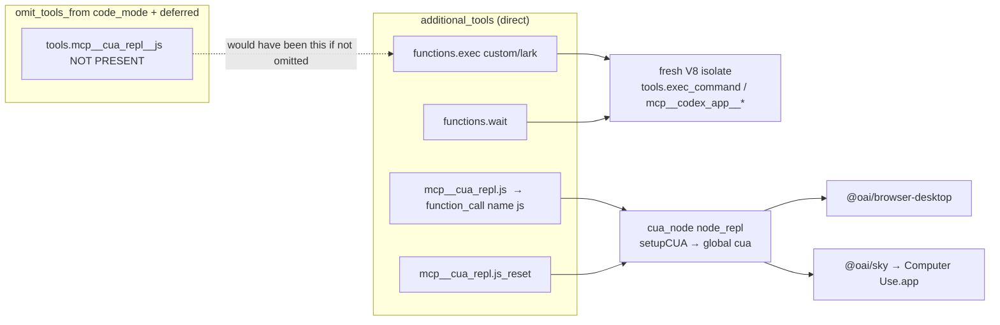

# FINDINGS — advertised tools vs CUA (`exec` is code-mode; `js` is CUA)

**Verdict.** Desktop Codex advertises **two different JavaScript tools** on the same `response.create`. They are not aliases.

| | `functions.exec` | `mcp__cua_repl.js` (model name `js`) |
|---|---|---|
| What it is | Code-mode public tool (`PUBLIC_TOOL_NAME` = `exec`) | CUA persistent Node REPL |
| Wire type | `custom` + Lark grammar (raw JS source) | `function` + JSON schema `{code, timeout_ms, title}` |
| Runtime | Fresh V8 isolate per call. **No Node, no FS, no network, no `console`** | `cua_node` `node_repl` with global `cua` / `nodeRepl` |
| Nested tools | `await tools.exec_command(...)`, `tools.mcp__codex_app__*`, `tools.web__run`, … | None. The JS *is* the UI API (`cua.getTab` / `cua.getApp`) |
| Companion | `functions.wait` (`cell_id`) | `mcp__cua_repl.js_reset` |
| In this capture | **Never called** | **All UI**: 37× `js` + 1× `js_reset` |

`cua_repl` is configured `omit_tools_from: ["code_mode", "deferred"]`. That is why `js` shows up as a **direct** additional_tools function instead of `await tools.mcp__cua_repl__js({code})` inside `exec`, and why the 53 297-byte `exec` description contains **zero** `cua_repl` / `js` / `cua.get*` strings.

Canonical dump (one tree, not 3 copies): [tools-tree.json](tools-tree.json).

Scope: desktop main session only, local disk only. Capture `/Users/dongdong/Desktop/codex拦截-两轮-raw.json` (both tasks, every `response.create`). Unnamed protocol items (`fc_*` item ids, `name=null` reasoning/message) are kept.

---

## 1. Parse — both tasks, every create

43 uplink frames, all `type: "response.create"`. Model `gpt-6-astra`. One thread: `prompt_cache_key` `01a08a67-c480-7392-b35d-24c7150359e8`. `additional_tools.id` is always `at_ef9dee31-7b6e-597f-9dc7-ece849132946`, `role: "developer"`.

| Task | Session | Creates | Physical `additional_tools` | Tree SHA-256 |
|---|---|---:|---:|---|
| `task-1-ant-design-form` | `0127_WS_backend-api_codex_responses` | 16 | create #1, #2 | `fb11379ffa00fc4d…be32bc43` |
| `task-2-linear-issue` | `0223_WS_backend-api_codex_responses` | 27 | create #1 | same |

**Injection rule (empirical, not “every create body contains the blob”):**

- `additional_tools` is attached only when `previous_response_id` is absent (session / turn refresh).
- The other 40 creates send `function_call_output` (sometimes a user `message`) and inherit the tool list via `previous_response_id` + `prompt_cache_key`.
- The tree on the 3 injections is **byte-identical** (one SHA-256). Deduped once in `tools-tree.json` → `advertised_tree`.

Create #1 of task 1 is the handshake: `generate: false`, input = `additional_tools` + developer system prompt, empty model output. Task 1 work starts on create #2 (same tools + user request + `<in-app-browser-context>`). Task 2 create #1 replays Form-task history (`14× function_call` + `14× function_call_output`) plus the Linear user turn, and re-injects the same `additional_tools`.

`tool_choice: "auto"`, `parallel_tool_calls: false` on every create.

---

## 2. Advertised tree (deduped)

Four namespaces, 13 leaves. No unknown keys beyond `format` (exec) and `strict` (every `function`). `strict` is always `false`.

```
additional_tools  role=developer  id=at_ef9dee31-…
├─ functions                  description=""
│  ├─ exec                    type=custom  format=lark   desc_len=53297
│  ├─ wait                    type=function              {cell_id, max_tokens, terminate, yield_time_ms}
│  ├─ request_user_input      type=function              Plan-mode sync questions
│  └─ request_user_input_async type=function             async questions (used)
├─ clock                      "Tools for reading and waiting on time."
│  └─ sleep                   {duration_ms}              1..43200000, ends early on new input
├─ collaboration              "Tools for spawning and managing sub-agents."
│  ├─ followup_task           {target, message}          message.encrypted=true
│  ├─ interrupt_agent         {target}
│  ├─ list_agents             {path_prefix?}
│  ├─ send_message            {target, message}          message.encrypted=true
│  ├─ spawn_agent             {task_name, message, …}
│  └─ wait_agent              {timeout_ms?}
└─ mcp__cua_repl              server_instructions.md
   ├─ js                      {code, timeout_ms?, title?}
   └─ js_reset                {}
```

Call names the model actually emits are the **leaf names**, not dotted paths: `exec`, `wait`, `js`, `js_reset`, `sleep`, `spawn_agent`, … MCP tools also carry `item.namespace = "mcp__cua_repl"`. `functions.*` / `clock.*` / `collaboration.*` have `namespace: null`.

Full schemas and descriptions: `tools-tree.json` → `advertised_tree`.

### 2.1 How `js` / `js_reset` text is built

`unified-computer-use` `launch.mjs` concatenates markdown into `NODE_REPL_TOOL_OVERRIDES`:

```
js.description =
  js-tool-description.md
  + browser-description.md      (surfaces includes browser)
  + computer-description.md     (surfaces includes computer)
  + js-output-description.md

js.field_descriptions.code = "JavaScript to execute using the initialized CUA runtime."
js_reset.description = js-reset.md
mcp__cua_repl.description = server-instructions.md
  "UI automation through a persistent JavaScript session using the initialized CUA API."
```

Codex then appends ` This tool is part of plugin \`unified-computer-use\`.` to both `js` and `js_reset` (not in the markdown files). `js_reset.md` says “the next **cua_repl.js** call” — a docs alias for the same MCP tool, not a second advertised name.

`turn_ended` is in `enabled_tools` but **not** in `additional_tools`. It is a hook tool (`Interrupt` / `Stop` / `SubagentStop` → `cua_repl.turn_ended`). Native `notify = [SkyComputerUseClient, "turn-ended"]` is a third path.

---

## 3. `exec` vs `js` — code-mode `PUBLIC_TOOL_NAME` vs CUA

### 3.1 `exec` is the code-mode public tool

The identifier `PUBLIC_TOOL_NAME` does **not** appear as a Latin string in `/Applications/ChatGPT.app/Contents/Resources/codex` (210 MB; likely const-folded to `"exec"`). The live object is still unambiguously the code-mode host tool:

1. **Wire shape.** Only `exec` is `type: "custom"` with `format: {type:"grammar", syntax:"lark", definition: pragma_source | plain_source}`. Input is raw JavaScript, optionally `// @exec: {"yield_time_ms":…, "max_output_tokens":…}` on line 1. Every other advertised leaf is a JSON-schema `function`.
2. **Description.** “Run JavaScript code to orchestrate/compose tool calls” in a **fresh V8 isolate as an async module**. Nested tools on global `tools` (`await tools.exec_command(...)`, `await tools.mcp__ologs__get_profile(...)`). Helpers: `exit`, `text`, `image`, `audio`, `generatedImage`, `store`/`load`, `notify`, `setTimeout`/`clearTimeout`, `ALL_TOOLS`, `yield_control()`. Explicit: **no Node, no file system, no network, no console**. Isolate dies when the script finishes; unawaited promises are discarded.
3. **Companion `wait`.** `cell_id` of a yielded exec cell; `yield_time_ms` / `max_tokens` / `terminate`. This is `core/src/tools/code_mode/wait_handler.rs`, not `clock.sleep`.
4. **Rust.** Binary source paths: `core/src/tools/code_mode/{mod,execute_handler,wait_handler,delegate}.rs`, `codex-code-mode-protocol`. Config structs: `CodeModeConfigToml` (`default_exec_yield_time_ms`, `excluded_tool_namespaces`, `direct_only_tool_namespaces`), `CodeModeHostConfigToml`. Features: `code_mode`, `code_mode_host`, `code_mode_buffered_exec`, `code_mode_prewarm`, `code_mode_interrupt`, `code_mode_only`. Desktop app-server is spawned with `-c features.code_mode_host=true` (agent 04).
5. **Self-identification.** Nested `image_gen__imagegen` docs: “In **code-mode**, use the first-line `@exec` directive…”.

`exec` is an orchestrator for *other* tools. It is not Computer Use.

### 3.2 `js` is CUA

`mcp__cua_repl.js` is a JSON function. `code` runs in the persistent `node_repl` after `NODE_REPL_JS_BANNER` (`setupCUA({browser, computer})`). That is tinysky-alt: `cua.getBrowser` / `getTab` / `getApp`, `tab.click`, `app.setValue`, `nodeRepl.write` / `emitImage`. First call (and first call after `js_reset`) is supposed to be exactly one entry-point API so the result can dump CUA docs + initial AX.

Three names for the same tool, observed in this capture:

| Layer | Name |
|---|---|
| additional_tools path | `mcp__cua_repl.js` |
| `function_call.name` (what the model emits) | `js` |
| `function_call.namespace` | `mcp__cua_repl` |
| `executed_tool_calls[].name` (uplink metadata) | `mcp__cua_repl__js` |
| `js_reset.md` prose | `cua_repl.js` |
| Code-mode nested id **if it were nested** (it is not) | `tools.mcp__cua_repl__js` |

Unprefixed `js` is the desktop MCP special case (`non_prefixed_mcp_tool_names` / node_repl+cua_repl). Generic `mcp_servers.node_repl` is also running (`config.toml`), but **additional_tools only contains `mcp__cua_repl`**. The model did not see a second `js`.

### 3.3 Split clock / split JS

The `clock` **namespace description** is reused in two places and then **split by surface**:

| Surface | Tool | Advertised? |
|---|---|---|
| direct additional_tools | `clock.sleep` | yes (`clock.sleep`) |
| nested in `exec` | `clock__curr_time` | only inside exec description |

Same pattern as CUA vs code-mode: sleep is a first-class function_call; current-time is an exec nested helper. `functions.wait` is exec-cell wait, not sleep.

---

## 4. Why `omit_tools_from: ["code_mode", "deferred"]`

Shipped and live plugin MCP (`RawMcpServerConfig.omit_tools_from`):

```json
"cua_repl": {
  "enabled_tools": ["js", "js_reset", "turn_ended"],
  "omit_tools_from": ["code_mode", "deferred"],
  "tools": { "js": { "output_token_limit": 25000 } }
}
```

Codex binary enum `ToolExposureSurface`: **`code_mode` | `deferred` | `direct`**.

| Surface | What it does | `cua_repl` |
|---|---|---|
| `code_mode` | Nest MCP tools inside `exec` as `tools.<server>__<tool>` | **omitted** — no `tools.mcp__cua_repl__js` |
| `deferred` | Deferred executor / `tool_search` / `deferred_tool_world_state`. Exec text: “Some **deferred** nested tools may be omitted from this description. They are still available on `tools` and `ALL_TOOLS`.” | **omitted** — not even an ALL_TOOLS / search hit |
| `direct` | Top-level additional_tools function_call | **this is where `js` / `js_reset` land** |

Contrast: ChatGPT.app injects `mcp_servers.codex_app` with `omit_tools_from: ["deferred"]` **only**. Those tools are therefore nested in `exec` (`mcp__codex_app__create_thread`, `capture_screen_context`, … — 31 identifiers) and are **absent** from additional_tools. That is the default MCP-in-code-mode shape. `cua_repl` is the exception.

### Why omit both (not just one)

1. **Different VM.** CUA needs a long-lived Node process, `cua` global, trusted RPC to `@oai/sky` / `@oai/browser-desktop`, screenshots, AX trees. `exec` is a short-lived isolate with no Node/FS/network. Putting CUA *inside* exec would be `await tools.mcp__cua_repl__js({code: "await cua.getApp(\"Linear\")"})` — a JS orchestrator calling another JS REPL, with REPL bindings dying whenever the isolate dies.
2. **Wrong MCP server in code-mode telemetry.** `app.asar` `tne()` hard-codes `pluginId: "computer-use@openai-bundled"`, `mcpServerName: "node_repl"`, `invocationSource: "code_mode"`. Generic `node_repl` has **no** `setupCUA` banner (skill still says `import("@oai/sky")`). Omitting `cua_repl` from `code_mode` keeps tinysky on the outer agent and avoids attributing Computer Use to the un-bannered REPL.
3. **Must stay always-on.** If `js` were only `deferred`, the model would have to `tool_search` for Computer Use. Desktop browser/computer-use is a primary surface; it is injected on the handshake create before the user message.
4. **Size.** `js` results are capped at 25 000 tokens; first `cua.getBrowser` / `cua.getApp` dumps tens of KB of CUA docs + AX. Inlining that as an exec nested-tool description is unusable (`exec` is already 53 297 bytes *without* CUA). `omit_tools_from: ["code_mode"]` also keeps that blob out of the orchestrator prompt.
5. **Guardian.** Codex `node_repl_policy` treats `node_repl` **or** `cua_repl` tool responses as untrusted evidence and recursively reviews nested actions. That policy is attached to the MCP server name, not to `exec`. Direct `js` is the path the policy is written for.

`omit_tools_from: ["deferred"]` is **not** “keep it always-on but hide the description”. The exec sentence about deferred tools still being on `ALL_TOOLS` applies to tools that *are* on the deferred surface. Omitting `deferred` removes `cua_repl` from that surface entirely. Combined with omitting `code_mode`, the only remaining surface is `direct`.

---

## 5. What the model actually called

Zero `function_call` named `exec`. Zero `wait`. Zero `sleep`. Zero `collaboration.*`. Zero Plan-mode `request_user_input`.

| Task | `js` | `js_reset` | `request_user_input_async` | `exec` |
|---|---:|---:|---:|---:|
| Form (0127) | 14 | 0 | 0 | 0 |
| Linear (0223) | 23 | 1 | 1 | 0 |
| **Total** | **37** | **1** | **1** | **0** |

Uplink `executed_tool_calls` (includes Form history replayed on Linear create #1): `mcp__cua_repl__js` ×51, `request_user_input_async` ×1, `mcp__cua_repl__js_reset` ×1. 51 = 14 history + 37 live.

Never-called advertised leaves: `exec`, `wait`, `request_user_input`, `sleep`, `followup_task`, `interrupt_agent`, `list_agents`, `send_message`, `spawn_agent`, `wait_agent`.

All UI is `js` `code` (tinysky). Linear also used `request_user_input_async` (issue title) and `js_reset` (wipe REPL bindings mid-task; next `cua.getApp` re-emits first-use docs).

---

## 6. Unnamed protocol items (kept)

整理 lists every tool call twice: once as `js` + `call_*`, once as `?` + `fc_*`. Those are **one** `function_call`:

| Field | Example | Role |
|---|---|---|
| `name` | `js` | model-visible tool name |
| `call_id` | `call_L5p0JtR28cUwYwLPKIq1YonC` | pairs with `function_call_output` |
| `id` | `fc_05a61cc4349bad21016aa26890d22c87d0ab3d38bdb9180aa6` | output item id (`fc_*`) |
| `namespace` | `mcp__cua_repl` or `null` | MCP vs functions |

Full dual-id list (39 rows, including `request_user_input_async` and `js_reset`): `tools-tree.json` → `unnamed_protocol_items.function_call_dual_ids`.

`output_item.done` items with `name: null` (not dropped):

| Task | `reasoning` | `message` |
|---|---:|---:|
| Form | 4 | 3 |
| Linear | 10 | 5 |

No uplink input item lacked `type`. Handshake create #1 completed with empty `output` (no message, no tools) — that empty completion is a real protocol item, not a parse miss.

---

## 7. Exec nested catalog (proof `js` is not inside `exec`)

Parsed from `functions.exec.description` (45 `###` tools). None of these are additional_tools siblings.

**First-party (ungrouped):** `apply_patch`, `create_goal`, `exec_command`, `get_goal`, `list_mcp_resource_templates`, `list_mcp_resources`, `read_mcp_resource`, `request_plugin_install`, `update_goal`, `view_image`, `write_stdin`.

**`clock`:** `clock__curr_time` only (not `sleep`).

**`image_gen`:** `image_gen__imagegen`.

**`mcp__codex_app` (31):** `automation_update`, `capture_screen_context`, `consume_usage_reset`, `create_sidebar_section`, `create_thread`, `delete_sidebar_section`, `end_realtime_voice_call`, `fork_thread`, `get_handoff_status`, `get_usage_limits`, `handoff_thread`, `list_archived_threads`, `list_projects`, `list_threads`, `load_workspace_dependencies`, `move_project_to_sidebar_section`, `move_thread_to_sidebar_section`, `navigate_to_codex_page`, `open_in_codex`, `read_thread`, `read_thread_terminal`, `rename_sidebar_section`, `reorder_section`, `reorder_sidebar_projects`, `reorder_sidebar_sections`, `send_message_to_thread`, `set_thread_archived`, `set_thread_title`, `share_thread`, `uninstall_plugin`, `wait_threads`.

**`web`:** `web__run`.

**Absent from the 53 297-byte description (search):** `cua_repl`, `mcp__cua_repl`, `mcp__cua_repl__js`, `js`, `js_reset`, `node_repl`, `cua.getApp`, `cua.getBrowser`.

That absence is the `omit_tools_from: ["code_mode"]` effect, observed in the live prompt, not inferred from config alone.

---

## 8. MCP tools that exist but are not additional_tools

| Server | Tool | Why the model does not see it here |
|---|---|---|
| `cua_repl` | `turn_ended` | `enabled_tools` for hooks only |
| stock `node_repl` binary | `js_add_node_module_dir` | stripped by `cua_repl.enabled_tools` |
| `mcp_servers.node_repl` | stock `js` / `js_reset` / … | running, but not in this session’s additional_tools |
| `codex_app` | `mcp__codex_app__*` | nested in `exec` (omitted from `deferred` only) |
| plugin `computer-use` native MCP | SkyComputerUseClient tools | `enabled: false` in user config; not this path |

---

## 9. Two JS paths (desktop main session)



This capture never enters the left path. Every click/type/AX/screenshot is the right path.

---

## Sources (local disk)

| What | Where |
|---|---|
| Capture, both tasks, every create | `/Users/dongdong/Desktop/codex拦截-两轮-raw.json` |
| Deduped tree + dual ids + exec nested catalog | [tools-tree.json](tools-tree.json) |
| `omit_tools_from` live | `~/.codex/plugins/cache/openai-bundled/unified-computer-use/26.903.61454/.mcp.json` |
| Description concat | `vendor/plugins/unified-computer-use/launch.mjs` + `resources/*.md` |
| `ToolExposureSurface` / `RawMcpServerConfig` / code_mode rust paths | `/Applications/ChatGPT.app/Contents/Resources/codex` strings |
| `tne()` code_mode → `node_repl` | `app.asar` (`agents/04-plugin-wiring/FINDINGS.md`) |
| `codex_app` `omit_tools_from: ["deferred"]` | same asar (`SO()` / `mcp_servers.codex_app=…`) |
